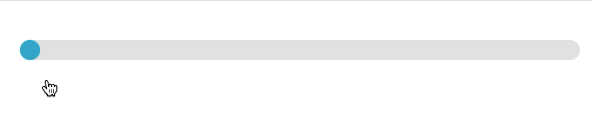
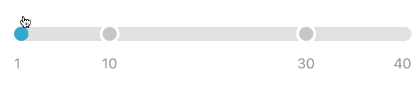
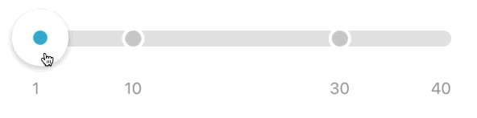
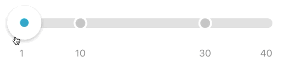

# Custom slider
Кастомные элементы интерфейса, с которыми будет взаимодействовать пользователь в `UIKit` принято наследовать от `UIControl` по той причине, что в `UIControl` есть 3 метода, которые легко модифицируются для реакции на пользовательские действия:
- `beginTracking(_ touch: UITouch, with event: UIEvent?) -> Bool`
- `continueTracking(_ touch: UITouch, with event: UIEvent?) -> Bool`
- `endTracking(_ touch: UITouch?, with event: UIEvent?)`

А так же `UIControl` объект позволяет подписаться на изменение значения через `.valueChanged`:
```swift
customSlider.addTarget(self, action: #selector(sliderValueChanged(_:)), for: .valueChanged)
```

В данной статье на примере слайдера-степпера (картинка ниже) я покажу как сделать кастомный элемент. На каждом из этапов будет представлена ссылка на исходный код.


Для начала унаследуем от `UIControl` и переопределим методы:
```swift
final class CustomSlider: UIControl {

    // MARK: - UIControl

    override func beginTracking(_ touch: UITouch, with event: UIEvent?) -> Bool {
        return handleBeginTracking(with: touch.location(in: self))
    }

    override func continueTracking(_ touch: UITouch, with event: UIEvent?) -> Bool {
        return handleContinueTracking(with: touch.location(in: self))
    }

    override func endTracking(_ touch: UITouch?, with event: UIEvent?) {
        handleEndTracking(with: touch?.location(in: self))
    }

    // MARK: - Private methods

    private func handleBeginTracking(with location: CGPoint) -> Bool {
        return true
    }

    private func handleContinueTracking(with location: CGPoint) -> Bool {
        return true
    }

    private func handleEndTracking(with location: CGPoint?) {}

}
```

**Договоримся:**
- трек, точки, текст будем делать через CALayer
- ползунок будем выставлять через картинку

## Для начала займемся треком
Создаем кастомный слой `CustomSliderTrackLayer`
Так как нам в будущем нужно будем анимировать этот слой в зависимости от прогресса (ниже показаны различные прогрессы), необходимо завести переменную, которая будет отвечать за прогресс (именно ее значение в дальнейшем и будем анимировать).


Получается такой скелет файла с методами, которые нам потребуются позже
```swift
final public class CustomSliderTrackLayer: CALayer {

    // MARK: - Properties

    @NSManaged public var percentage: CGFloat

    // MARK: - Initialization

    // для обычной инициализации
    override init() {
        super.init()
    }

    // для инициализации при анимации
    override init(layer: Any) {
        super.init(layer: layer)
        guard let progressLayer = layer as? CustomSliderTrackLayer else {
            return
        }
        self.percentage = progressLayer.percentage
    }

    required init?(coder aDecoder: NSCoder) {
        super.init(coder: aDecoder)
    }

    // MARK: - CALayer

    // здесь будет логика отрисовки прогресс линии
    override public func draw(in context: CGContext) {}

    // здесь будем просить перерисовать слой, когда меняется значение percentage
    override public class func needsDisplay(forKey key: String) -> Bool {
        return false
    }

    // при изменении свойства percentage снаружи будем запускать анимацию
    override public func action(forKey event: String) -> CAAction? {
        return nil
    }

}
```

Важное замечание - когда происходит анимация, `CAAnimation` создает слой-дубликат для анимации, поэтому необходимо переопределить `init(layer: Any)` и передать туда параметры старого слоя

**Реализация отдельных методов:**
```swift
override public func draw(in context: CGContext) {
    // draw gray rect
    let path = UIBezierPath(roundedRect: bounds, cornerRadius: cornerRadius)
    context.addPath(path.cgPath)

    context.setFillColor(Constants.grayColor.cgColor)
    context.fillPath()

    // draw blue rect
    let trackHeight = CustomSlider.Constants.trackHeight
    let contentWidth = (bounds.width - trackHeight)
    let percentage = (presentation()?.percentage ?? 0)
    let valuePosition = percentage * contentWidth + trackHeight
    let rect = CGRect(x: 0, y: 0, width: valuePosition, height: bounds.height)
    let otherPath = UIBezierPath(roundedRect: rect, cornerRadius: cornerRadius)
    context.addPath(otherPath.cgPath)

    context.setFillColor(Constants.blueColor.cgColor)
    context.fillPath()
}
```

```swift
override public class func needsDisplay(forKey key: String) -> Bool {
    if key == #keyPath(CustomSliderTrackLayer.percentage) {
        return true
    }
    return super.needsDisplay(forKey: key)
}
```

```swift
override public func action(forKey event: String) -> CAAction? {
    // пока нет логики пошагового изменения значени, оставим nil
    return nil
}
```

Добавив немного логики в CustomSlider, получим:


Код на данном этапе доступен [здесь](https://github.com/alexfilimon/custom-slider/commit/b38ad9840f1e54a2565552a98c73aaa08436d5c6)

## Теперь приступим к рисованию точек и текста
**Идея отрисовки заданного дизайна точек заключается в том, чтобы создать 2 точки:**
- большая точка - будет прозрачная, но иметь белую рамку
- маленькая точка будет иметь полупрозрачный фон (таким образом немного затемняя полосу прогресса)

Заведем свойство для точек `values: [Int]` и сделаем конфигурацию извне: `public func configure(with values: [Int])`

Заведем приватные свойства:
```swift
// для точек - большая/маленькая точка
private var points: [Int: (bigPoint: CAShapeLayer, smallPoint: CAShapeLayer)] = [:]

// для текста
private var labels: [Int: CATextLayer] = [:]
```

Добавляем методы конфигурации и перерисовки точек и текста
```swift
private func configurePoints() {}
private func configureLabels() {}
private func drawPoints() {}
private func drawLabels() {}

// дополнительные методы
private func smallPointOrigin(for value: Int) -> CGPoint {}
private func bigPointOrigin(for value: Int) -> CGPoint {}
private func position(for value: Int) -> CGFloat {} // для определения в каком месте рисовать точки
private func removeOldPoints() {}
private func removeOldLabels() {}
private func nearestValue(for value: Int) -> Int {} // возвращает ближайшее значение в точке
```

Рассмотрим основные:
```swift
private func configurePoints() {
    removeOldPoints()

    for value in values {
        // пропускаем минимальное и максимально значения
        guard value != minValue && value != maxValue else {
            continue
        }

        // создаем и добавляем точки в массив
        let smallPoint = CAShapeLayer()
        let bigPoint = CAShapeLayer()
        points[value] = (bigPoint: bigPoint, smallPoint: smallPoint)
        layer.addSublayer(bigPoint)
        layer.addSublayer(smallPoint)
    }
}
```

```swift
private func configureLabels() {
    removeOldLabels()

    for value in values {
        // создаем и конфигурируем текстовые подписи
        let label = CATextLayer()
        label.font = Constants.labelFont
        label.fontSize = Constants.labelFontSize
        label.foregroundColor = GlobalConstants.grayTextColor.cgColor
        label.string = String(Int(value))
        label.contentsScale = UIScreen.main.scale //важно, чтобы не было пикселизированного изображения

        // alignment
        if value == minValue {
            label.alignmentMode = .left
        } else if value == maxValue {
            label.alignmentMode = .right
        } else {
            label.alignmentMode = .center
        }

        labels[value] = label
        layer.addSublayer(label)
    }
}
```

```swift
private func drawPoints() {
    for point in points {
        // определяем размеры точек и круглый path
        let smallPointSize = CGSize(width: Constants.smallPointSize, height: Constants.smallPointSize)
        let bigPointSize = CGSize(width: Constants.bigPointSize, height: Constants.bigPointSize)
        let smallOvalPath = UIBezierPath(ovalIn: CGRect(origin: .zero, size: smallPointSize))
        let bigOvalPath = UIBezierPath(ovalIn: CGRect(origin: .zero, size: bigPointSize))

        // задаем точкам frame
        point.value.smallPoint.frame = CGRect(origin: smallPointOrigin(for: point.key), size: smallPointSize)
        point.value.bigPoint.frame = CGRect(origin: bigPointOrigin(for: point.key), size: bigPointSize)

        // применяем path
        point.value.smallPoint.path = smallOvalPath.cgPath
        point.value.bigPoint.path = bigOvalPath.cgPath

        // конфигурируем цвета точек
        point.value.bigPoint.lineWidth = Constants.bigPointSize - Constants.smallPointSize
        point.value.bigPoint.fillColor = UIColor.clear.cgColor
        point.value.bigPoint.strokeColor = backgroundColor?.cgColor
        point.value.smallPoint.fillColor = UIColor.black.cgColor
        point.value.smallPoint.opacity = Constants.smallPointOpacity

        // вызываем перерисовку
        point.value.smallPoint.setNeedsDisplay()
        point.value.bigPoint.setNeedsDisplay()
    }
}
```

```swift
private func drawLabels() {
    for label in labels {
        // высчитываем и задаем bounds
        let x = position(for: label.key)
        let labelSize = CGSize(width: trackLayer.bounds.width, height: Constants.labelFontSize)
        label.value.bounds = CGRect(origin: .zero, size: labelSize)

        // высчитываем и задаем position
        let trackTopOffset = Constants.trackTopOffset
        let trackHeight = Constants.trackHeight
        let labelTopOffset = Constants.labelFromTrackTopOffset
        let y = trackTopOffset + trackHeight + labelTopOffset

        if label.key == minValue || label.key == maxValue {
            label.value.position = CGPoint(x: trackLayer.position.x, y: y)
        } else {
            label.value.position = CGPoint(x: x, y: y)
        }
    }
}
```

Получим почти готовый кастомный UIControl элемент:


Код на данном этапе доступен [здесь](https://github.com/alexfilimon/custom-slider/commit/98be554605dcd6933eedc73cc57d5cb2cd687e12)

## Следующий шаг - сделаем сам ползунок:
Нам необходимо добавить `UIImageView` с картинкой и сделать передвижение этого блока при пользовательском взаимодействии со слайдером.

Создаем и конфигурируем `UIImageView`:
```swift
thumbImageView.image = thumbImage
thumbImageView.contentMode = .center
addSubview(thumbImageView)
```
Добавляем метод обновления frame:
```swift
private func updatedThumbFrame() -> CGRect {
    let thumbFrame = CGRect(origin: thumbOrigin(for: value), size: Constants.thumbSize)
    return thumbFrame.offsetBy(dx: 0, dy: Constants.thumbImageDyOffset)
}
```

Подгоняем константы под необходимые размеры (чтобы `thumbImage`  не выходила за пределы `UIControl`), а так же делаем ползунок по размеру больше, чем размер картинки, чтобы пользователь с легкостью мог попасть по ползунку (минимально рекомендуемый размер 44*44).

ВАЖНО: для фикса бага с перекрыванием точек UIImageView необходимо после конфигурирования точек сделать `brinToFront` для  `UIImageView` :
```swift
private func configurePoints() {
    // ...        
    bringSubviewToFront(thumbImageView)
}
```

После этого остается для `thumbImage` добавить только анимацию.
Для этого в `animateChanging` необходимо задать для `position` анимацию слоя `UIImageView` и изменить значение `percentage` для `trackLayer`. Важно это сделать в `CATransaction`:
```swift
private func animateChanging() {
    CATransaction.begin()
    CATransaction.setAnimationDuration(GlobalConstants.animationDuration)
    CATransaction.setAnimationTimingFunction(CAMediaTimingFunction(name: .easeInEaseOut))

    // animate track
    trackLayer.percentage = percentage(for: value)

    // анимация позиции
    let frameAnimation = CABasicAnimation(keyPath: #keyPath(CALayer.position))
    let oldFrame = thumbImageView.layer.presentation()?.frame ?? .zero
    let newFrame = updatedThumbFrame()
    frameAnimation.fromValue = CGPoint(x: oldFrame.midX, y: oldFrame.midY)
    frameAnimation.toValue = CGPoint(x: newFrame.midX, y: newFrame.midY)
    thumbImageView.layer.removeAllAnimations()
    thumbImageView.layer.add(frameAnimation, forKey: #keyPath(CALayer.position))
    thumbImageView.frame = newFrame

    CATransaction.commit()
}
```

Получим анимированный `thumbImageView`:


Код на данном этапе доступен [здесь](https://github.com/alexfilimon/custom-slider/commit/aaa3a7bab3a85f14cfafc443018a056b83eae6c1)

## Финальные шаги
Последнее что нам осталось сделать это правильно ответить слайд пользователя и сделать возможность нажать на любое место `UIControl` для выставления ближайшего значения.

Для этого заведем переменную, с помощью которой мы отследим нажал ли пользователь на `thumbImage` в начале слайда или нет.

Получим:
```swift
private func handleBeginTracking(with location: CGPoint) -> Bool {
    // чтобы понять нажали ли мы на thimbImage
    canSlide = thumbImageView.frame.contains(location)

    return true
}

private func handleContinueTracking(with location: CGPoint) -> Bool {
    guard canSlide else {
        return false
    }

    // ...

    return true
}

private func handleEndTracking(with location: CGPoint?) {
    guard !canSlide, let x = location?.x else {
        return
    }

    // высчитываем новое значение
    let trackContentHorizontalOffset = Constants.trackHeight / 2 + Constants.trackHorizontalOffset
    let trackContentWidth = bounds.width - trackContentHorizontalOffset * 2
    let newPercentage = (x - trackContentHorizontalOffset) / trackContentWidth

    var newValue = Int(newPercentage * CGFloat(maxValue - minValue)) + minValue
    newValue = boundValue(newValue)
    newValue = nearestValue(for: newValue)

    // если значение изменилось, анимируем
    if newValue != value {
        value = newValue
        animateChanging()
        sendActions(for: .valueChanged)
    }
}
```

## Финальный результат:


Финальный результат можно найти [здесь](https://github.com/alexfilimon/custom-slider/commit/83443814ba6e826c271d85b91e29eb0a304f8dfb)

#работа/surf/unicredit
